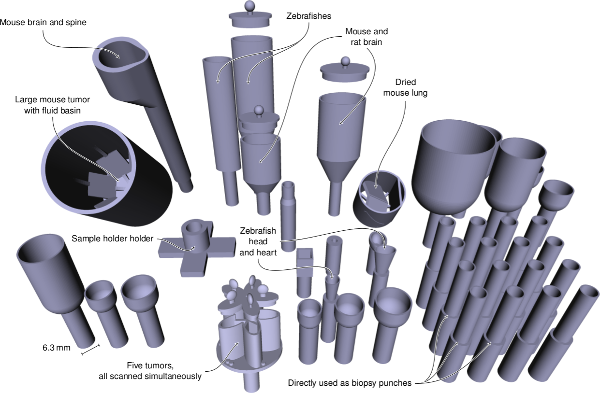

# OpenSCAD models

This repository is a collection of sample holder for our [uCT scanners](http://bruker-microct.com/products/all_products.htm) (1172 and 1272).

Models are generated/written in [OpenSCAD](http://www.openscad.org/).
The .scad-Files in this folder are the *originals*.
Those are then exported to [STL](https://en.wikipedia.org/wiki/STL_(file_format)) files (into the [STL](STL) folder) to be printed on our [Form 2](http://formlabs.com/products/3d-printers/form-2/) 3D printer.
This also makes it possible to nicely view the STL files, since [GitHub renders them in 3D](https://github.com/blog/1465-stl-file-viewing).

# [Contributions welcome](http://contributionswelcome.org/)

All contributions (no matter how small) are always welcome.
To see how you can help and where to start [see the Contributing file](CONTRIBUTING.md).
